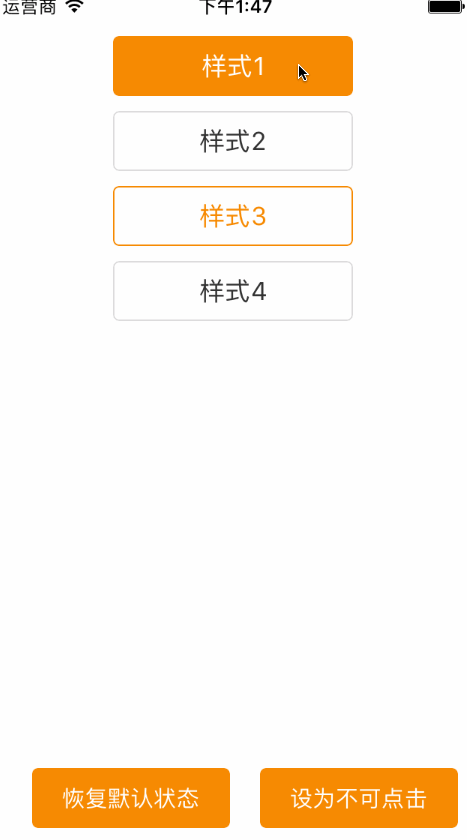

[TOC]

## 简介

`ZHStyleButton`是 `UIButton`的子类可以设置 `默认` `高亮` `不可点击`三种状态下面的

* 边框宽度`boardWidth`
* 边框颜色`boardColor`
* 圆角大小`cornerRadius`
* 背景颜色`backgroundColor`
* 文本颜色`textColor`

## 例子

### 例子1

* 默认状态:

  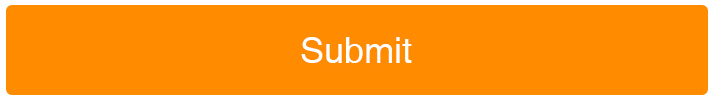

* 高亮状态:

  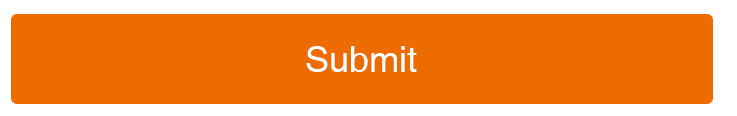

* 不可点击状态

  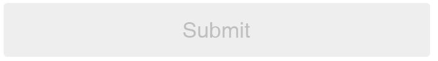

### 例子2

* 默认状态

  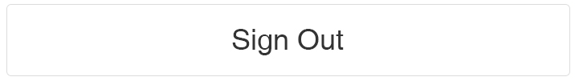

* 高亮状态

  

* 不可点击状态

  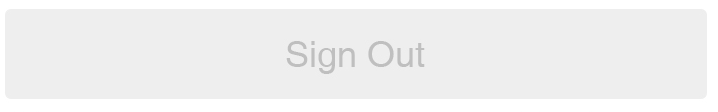

### 例子3

* 默认状态

  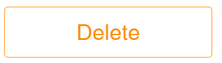

* 高亮状态

  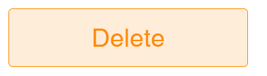

* 不可点击状态

  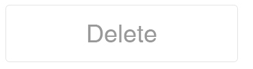

### 例子4

* 默认状态

  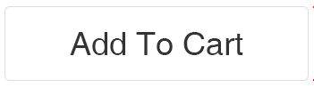

* 高亮状态

  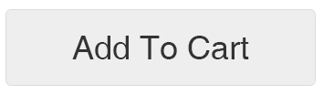

* 不可点击状态

  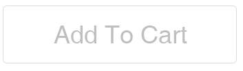

## 怎么安装

```ruby
pod 'ZHStyleButton'
```

## 怎么使用

可以参考下面的例子：

